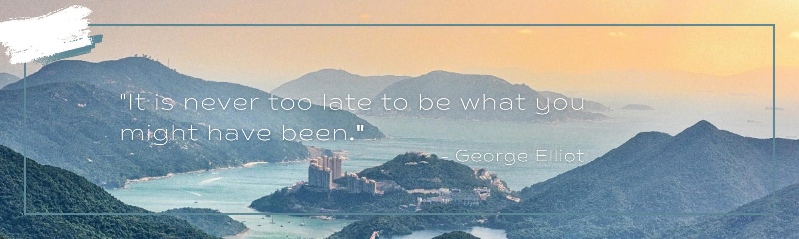

## Hi there, I'm Kinski 🙋🏻‍♀️

> ### I'm a software engineer👩🏻‍💻, open source advocate, and co-creator of [NextView](https://www.nextview.dev), *an open-source developer tool for monitoring Next.js application performance*.
>
> ### Outside of software engineering, I enjoy hanging upside down from an aerial apparatus to explore the world from a unique perspective 🤸🏻‍♀️, hiking in Mount Kurama in Kyoto in search of the mystical Tengu 👺, and finding solace in solving puzzles on artificial rock formations. 🧗🏻‍♀️

 

### 🔧 Languages and Tools:
>
>
>
>
>
>
>
>
>
>
>
>
>

 

### 🤝 Connect with me:
>
>

 

### 🌟 Github Stats:
>
